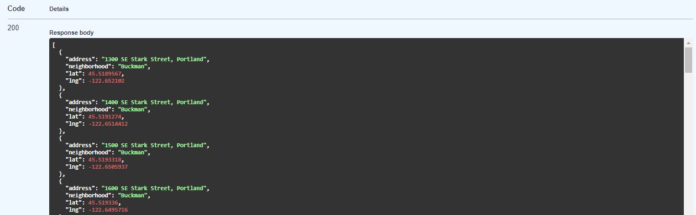
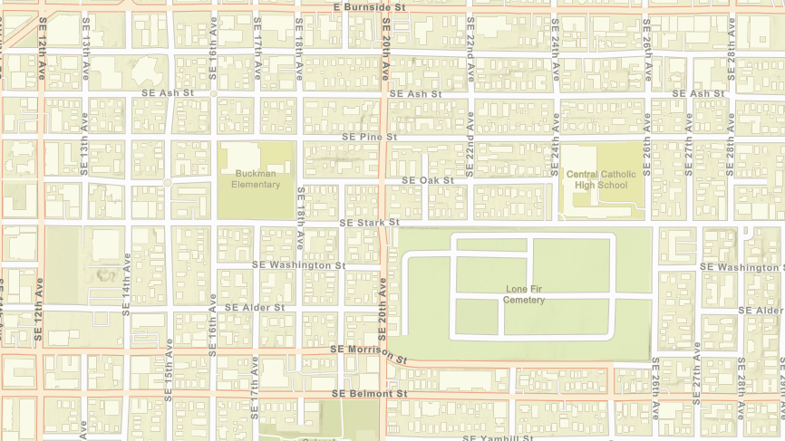

<h1 align=center>Neighborhoods API Technical Assessment</h1>

<div align=center>
<a href="#description">Description</a> |
<a href="#tech">Tech Stack</a> |
<a href="#requirements">Requirements</a> |
<a href="#steps">Algorithm Steps</a> |
<a href="#endpoints">Endpoints</a> |
<a href="#results">Results on map</a>

</div>


<div id="description"></div>

## Description


This project contains a Fast API application with an endpoint to obtain the result of the recursive algorithm that iterates untill find a new neigborhood. Also contains an HTML that requests to the API and show the results in a ArcGIS Map for JavaScript.

<div id="tech"></div>

## Tech Stack

###Front End

**Language:** JavaScript
**Map:** ArcGIS Map for JavaScript


###Back End

**Language:** Python
**Web Framework:** FastAPI

<div id="requirements"></div>

## Requirements

 * Git
 * Python
 * Docker Engine *(Optional)*

<div id="steps"></div>

## Algorithm Steps.

1. Receive a textual address `1300 SE Stark Street, Portland`
2. Request to a Google Maps API for the coordinates.
3. Request to Portland Maps Enpoint for the name of the neighborhood.
4. Recursively iterates adding 100 to the address untill find a new neighborhood name. 
5. Returns a JSON with the coordinates.


<div id="endpoints"></div>

## Endpoints

This project currently contains just one endpoint to obtain the algorithm result.

```
http://localhost:8000/process_adress
```

Response: Application/Json




<div id="results"></div>

## Results on map

The following is a GIF that shows the results returned by the API printed on the MAP





